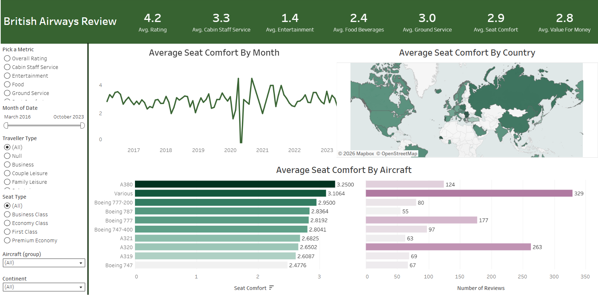

# ✈️ British Airways Reviews – Interactive Tableau Dashboard

## 📌 Project Overview
This project transforms raw British Airways customer review data into a **fully interactive Tableau dashboard** that allows users to explore airline performance across countries, aircraft, traveler segments, and time.

The dashboard was built as a portfolio project to demonstrate a **real-world end-to-end analytics workflow** and the ability to design self-service business intelligence tools.

---

## 🎯 Business Problem
Airlines receive thousands of reviews containing valuable feedback on service quality, comfort, and overall experience.  
However, raw review data makes it difficult to quickly answer key questions:

- Which countries give the best and worst ratings?
- How has customer satisfaction changed over time?
- Which aircraft perform best or worst?
- Which service areas most affect customer satisfaction?
- How do ratings vary by traveler type or seat class?

Stakeholders need a **single interactive dashboard** to explore these questions without technical knowledge.

---

## 📊 Dashboard Preview

---

## 🔗 Live Interactive Dashboard
👉 **View on Tableau Public:**  
**[(https://public.tableau.com/app/profile/nirjala.prajapati/viz/BritishAirwaysRevuewDashboard/Dashboard1)]**

---

## 🗂️ Dataset

### 1️⃣ British Airways Reviews
Each row represents a customer review including:
- Review date
- Country of reviewer
- Aircraft
- Traveler type
- Seat type
- Ratings across multiple service categories

### 2️⃣ Country Mapping Table
Used to enrich reviews with:
- Continent
- Region

Both tables were related in Tableau using the **Country field**.

---

## ⚙️ Methodology

### Data Modeling
- Connected multiple CSV datasets in Tableau
- Created relationships between review and country data
- Assigned geographic roles for mapping

### Dynamic Metric Selection (Key Feature)
A **parameter + calculated field** allows users to toggle between:

- Overall Rating  
- Cabin Staff Service  
- Entertainment  
- Food & Beverages  
- Ground Service  
- Seat Comfort  
- Value for Money  

All dashboard visuals update automatically when the metric changes.

### Data Preparation & Feature Engineering
- Grouped aircraft with fewer than 50 reviews into **“Various”**
- Created global dashboard filters:
  - Month (timeline)
  - Traveler type
  - Seat type
  - Aircraft group
  - Continent

---

## 📈 Dashboard Visualizations

### 🌍 Average Metric by Country (Map)
- Dynamic color map based on selected metric
- Tooltip shows:
  - Average rating
  - Number of reviews
- Map acts as a filter for other visuals

### 📅 Rating Trend Over Time (Line Chart)
- Monthly trend of selected metric
- Helps identify patterns and seasonality

### ✈️ Metric by Aircraft (Dual Bar Chart)
Compares:
- Average rating by aircraft  
- Number of reviews per aircraft  

### 📊 Summary KPI Panel
Displays overall averages for all rating categories.

---

## 🎛️ Dashboard Interactivity

Users can:
- Switch between rating metrics  
- Filter by traveler type, seat class, aircraft, continent, and date  
- Click charts to filter the entire dashboard  
- Explore global and time-based trends instantly  

This creates a **self-service analytics experience**.

---

## 🛠️ Tools & Skills Demonstrated

**Tools**
- Tableau Public

**Skills**
- Data Visualization  
- Interactive Dashboard Design  
- Tableau Parameters & Calculated Fields  
- Geographic Analysis  
- Dashboard UX & Layout Design  
- Data Modeling in Tableau  

---

## 💡 Insights Enabled
This dashboard allows stakeholders to:

- Identify top and low performing countries  
- Compare aircraft performance  
- Analyze satisfaction trends over time  
- Understand which service areas drive ratings  
- Explore data without technical expertise  

---

## 🚀 Future Improvements
Potential enhancements:
- Sentiment analysis on review text
- Airline comparison dashboard
- Predictive modeling for satisfaction trends
- Integration with live review data
